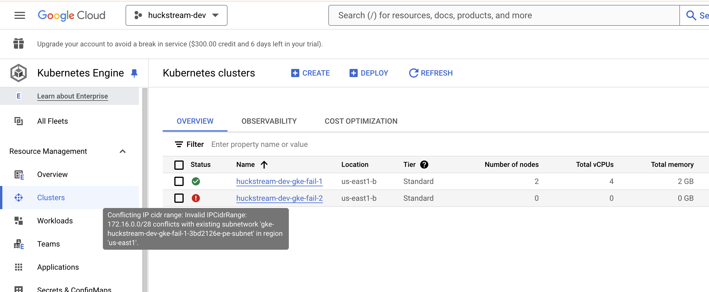

# Bugtest | GKE Failure

## Overview
This repository contains code for reproducing a Google cloud resource failure mode that leaves a broken state and abandoned resources when creating GKE clusters that have conflicting CIDR range configurations. This failure mode is likely represenatative of a class of failures where the cluster is successfully created, but cannot bootstrap or otherwise fully come into full service.

## Failure Details

1. Configure `Pulumi.yaml` and `Pulumi.dev.yaml` as desired

2. Create a stack to work with
```zsh
❯ pulumi stack init dev
Created stack 'dev'
❯ pulumi stack select dev
❯
```

3. Create resources

Run a full deployment:
```zsh
pulumi up
```
Operation should fail with error messages as shown:

[](https://www.google.com/)

4. Inspect state

Show state file contents:
```zsh
pulumi stack --show-urns --show-ids
```
The state will contain no entries or references for the second GKE cluster, `gke-fail-2`:

[](https://www.google.com/)

5. Inspect GKE console

Log into Google Cloud console's [GKE clusters view](https://console.cloud.google.com/kubernetes/list). In the correct project, you should see two clusters, the health cluster `gke-fail-1` and the broken `gke-fail-2`:

[](https://www.google.com/)


## Development Bootstrapping

### Configure Pulumi Cloud

Requires a Pulumi cloud organization. Sign up [here](https://app.pulumi.com/signup). Authenticate with

```zsh
❯ pulumi login
```

Your Pulumi identity will require permissions to create stacks.

Additionally, the dev stack expects the GCP OIDC authentication to be preconfigured, and available in the `gcp-dev` environment. Refer to the [Pulumi docs](https://www.pulumi.com/docs/pulumi-cloud/access-management/oidc/provider/gcp/) for more information on configuring this authentication. Your Pulumi identity will need to have permissions to open that environment.

### Configure shell environment

Ensure that a GitGuardian API key is available in shell context under `GITGUARDIAN_API_KEY`, such as in `~/.zshenv`

### Install dependencies:

```zsh
brew install \
  commitizen \
  ggshield \
  pre-commit \
  pulumi \
  python \
  pipx
```

### Install pre-commit hooks

```zsh
pre-commit install --hook-type commit-msg --hook-type pre-commit
```

If you are using GitKraken, manually update hook scripts to load proper shell context.
For example, in zsh add:

```zsh
source ~/.zshenv
```

To the install files:

```zsh
vi .git/hooks/commit-msg
vi .git/hooks/pre-commit
```

### Install Poetry

```zsh
pipx install poetry
```

### Install Python dependencies

```zsh
poetry install
```
